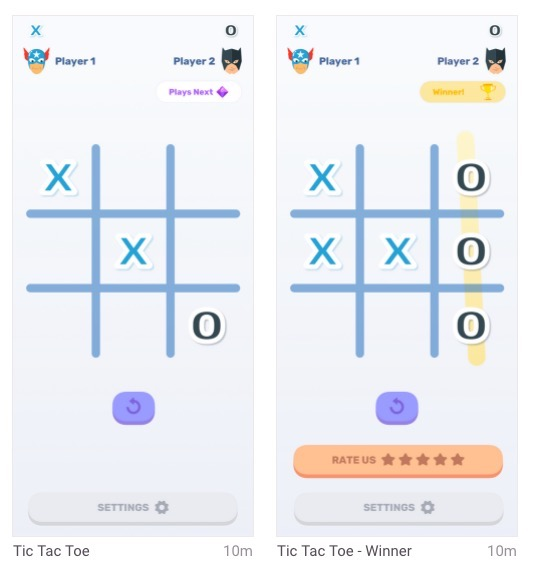

# The Really Good Challenge

A fun opportunity to flex your React/TypeScript/UI development muscles, while possibly landing a Really Good job 💪

Based on **React Cool Starter** - its docs are left below for your convenience.

We provided the surrounding project (with React, TypeScript, Jest, CSS Components & HMR for rapid development), so you can focus on the `TicTacToe` component.

Run `yarn` to install deps and `yarn dev` to start a development server for port 3000.

## Tic Tac Toe - Logic

Your goal is to create a functioning Tic Tac Toe game. It should work the following way: the first player to go places an X anywhere on the board by clicking a square, and then the next player will be able to place an O, and it continues alternating like this every turn.

You should also implement a function to determine if any player won by getting 3 X's or O's in a row (at any direction, including diagonally). If there is a winner, display a message at the top. If nobody wins, then do not display any message. Finally, you should also implement the reset function that resets the entire board.

Submit your code once it is complete as a PR to the `master` branch on this repo (which should be your own private repo on github), and ping us when done.

Don't go into anything server-side/redux related.

## Tic Tac Toe - Part II, UI

Only once the Logic PR is submitted, create a new branch deriving from the logic branch and work to make the UI closely match the following design:

SVG files are available under [components/TicTacToe/assets](src/components/TicTacToe/assets)

**Ping us to get a Zeplin invite to this project**. We understand this may be a lot, so try not to spend over two hours with this part, and prioritize as you see fit.

_Good luck and enjoy,_

_Really Good_

# React Cool Starter (original Readme)

See [here](https://github.com/wellyshen/react-cool-starter)
